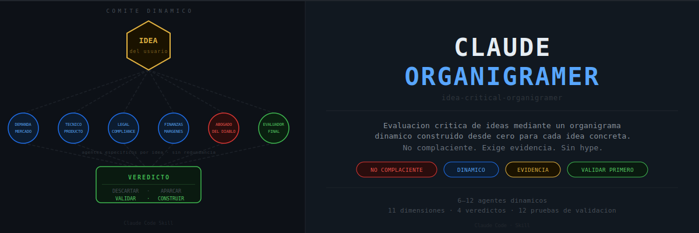

<div align="center">
  
</div>

<br/>

<div align="center">

[Que es](#que-es) &nbsp;·&nbsp; [Como funciona](#como-funciona) &nbsp;·&nbsp; [Por que es dinamico](#por-que-es-dinamico) &nbsp;·&nbsp; [Ejemplo](#ejemplo-dark-kitchen) &nbsp;·&nbsp; [Uso](#como-activar-la-skill) &nbsp;·&nbsp; [Estructura](#estructura-del-repositorio)

</div>

---

## Que es

Claude Organigramer es un repositorio de Skills para Claude Code que contiene la Skill `idea-critical-organigramer`.

Evalua ideas de negocio, producto, automatizacion, aplicaciones, servicios SAP/enterprise, contenido, herramientas IA, inversiones y cualquier otro proyecto mediante un **comite dinamico de agentes especialistas construido desde cero para cada idea**.

No es un generador de planes de negocio. No es una herramienta de motivacion. Es un sistema de evaluacion critica cuyo unico objetivo es determinar si una idea merece ser descartada, aparcada, validada o construida.

---

## El problema con las evaluaciones convencionales

```
IDEA  →  PLANTILLA GENERICA  →  mismo analisis para un SaaS que para un bar
                              →  mismo analisis para una app medica que para una newsletter
                              →  sin detectar las funciones criticas especificas
                              →  sin ajustar el escrutinio a la complejidad real
```

Claude Organigramer construye el comite desde cero para cada idea a partir de sus funciones criticas concretas.

---

## Como funciona

```
                        IDEA DEL USUARIO
                               |
               +---------------+---------------+
               |    INFERENCIA DE LA           |
               |    ORGANIZACION NECESARIA     |
               |    tipo · modelo · cliente    |
               |    canal · complejidad        |
               |    dependencias criticas      |
               +---------------+---------------+
                               |
               +---------------+---------------+
               |    FUNCIONES CRITICAS         |
               |    Solo las que pueden matar  |
               |    o salvar esta idea         |
               +---------------+---------------+
                               |
               +---------------+---------------+
               |    COMITE DINAMICO            |
               |    Un agente por funcion      |
               |    critica. Sin redundancia.  |
               |    Sin agentes decorativos.   |
               +-------+-------+-------+-------+
                       |               |
            +----------+---+   +-------+----------+
            |  ESPECIALISTAS|   |  ABOGADO DEL    |
            |               |   |  DIABLO         |
            |  · Senales +  |   |                 |
            |  · Senales -  |   |  Unica funcion: |
            |  · Complejidad|   |  encontrar por  |
            |    oculta     |   |  que va a       |
            |  · Propuestas |   |  fracasar.      |
            |    de mejora  |   |                 |
            |  · Pregunta   |   |                 |
            |    critica    |   |                 |
            +----------+---+   +-------+----------+
                       |               |
               +-------+---------------+-------+
               |    MATRIZ DE PUNTUACION       |
               |    11 dimensiones  /  0–10    |
               +---------------+---------------+
                               |
               +---------------+---------------+
               |    EVALUADOR FINAL            |
               |                               |
               |    DESCARTAR                  |
               |    APARCAR                    |
               |    VALIDAR       ← habitual   |
               |    CONSTRUIR     ← solo con   |
               |                    evidencia  |
               +---------------+---------------+
                               |
               +---------------+---------------+
               |    PRUEBA MINIMA              |
               |    DE VALIDACION              |
               |    Ejecutable en menos        |
               |    de 7 dias                  |
               +-------------------------------+
```

---

## Por que es dinamico

Dos ideas del mismo sector producen comites completamente distintos porque sus funciones criticas son distintas.

```
              HOSTELERIA — mismo sector, comites distintos
                              |
          +-------------------+-------------------+
          |                                       |
   CAFE ESPECIALIDAD                    BAR NOCTURNO
   zona residencial                     copas
          |                                       |
   Funciones criticas:           Funciones criticas:
   · Ubicacion/trafico           · Licencia nocturna
   · Recurrencia cliente         · Insonorizacion
   · Diferenciacion producto     · Seguridad local
   · Margen unitario             · Margen en alcohol
   · Proveedores de grano        · Personal nocturno
   · Operaciones ligeras         · Gestion de afluencia
          |                                       |
   AGENTES ESPECIFICOS           AGENTES COMPLETAMENTE
   PARA ESTAS FUNCIONES          DISTINTOS
```

La Skill no tiene listas cerradas. Tiene un metodo para inferir que agentes son necesarios para cada idea especifica.

---

## Lo que aporta cada agente

Cada agente del comite emite un informe estructurado con seis bloques:

```
+--------------------------------------------------+
|  AGENTE ESPECIALISTA                             |
+--------------------------------------------------+
|                                                  |
|  Senales positivas     Lo que juega a favor      |
|  Senales negativas     Lo que juega en contra    |
|  Complejidad oculta    Lo que no has visto aun   |
|  Pregunta critica      Lo que debes responder    |
|  Propuestas de mejora  Acciones concretas        |
|                        para fortalecer el plan   |
|  Recomendacion         Su posicion sobre la idea |
|                                                  |
+--------------------------------------------------+
```

Las propuestas de mejora son especificas para esa idea concreta en esa area de responsabilidad. No son consejos genericos.

---

## Los cuatro veredictos

| Veredicto | Cuando se emite |
|---|---|
| **DESCARTAR** | Demanda debil, rentabilidad dudosa, legal bloqueante, ejecucion sin retorno suficiente |
| **APARCAR** | Idea interesante pero prematura, no prioritaria o sin encaje con los recursos actuales |
| **VALIDAR** | Default para ideas prometedoras sin evidencia de demanda. Hay que probar antes de construir |
| **CONSTRUIR** | Solo si existe evidencia previa de demanda real. Prohibido sin datos de pago confirmados |

---

## Ejemplo: dark kitchen

**Idea presentada:**
> Quiero montar una dark kitchen especializada en bowls saludables para delivery. Solo en Madrid. Sin local a pie de calle.

**Funciones criticas inferidas por la Skill:**

```
· Margen real despues de comisiones de plataforma (30-35% en Glovo/Uber/JustEat)
· Posicionamiento en apps frente a 40-80 competidores directos en Madrid
· Velocidad de produccion y control de calidad en pedidos simultaneos
· Diferenciacion real en mercado saturado de opciones saludables
· Licencia de actividad de cocina (requisitos administrativos y sanitarios)
· Dependencia del repartidor externo (tiempo, calidad en entrega)
```

**Comite generado:**

```
+---------------------------------------------------+
|  COMITE  ·  DARK KITCHEN BOWLS MADRID             |
+---------------------------------------------------+
|                                                   |
|  1  Analista de economicas de delivery            |
|     Comisiones reales Glovo / Uber / Just Eat     |
|                                                   |
|  2  Especialista en posicionamiento               |
|     en apps de delivery                           |
|                                                   |
|  3  Responsable de produccion                     |
|     y control de tiempos en cocina                |
|                                                   |
|  4  Analista de diferenciacion de marca           |
|     sin local fisico                              |
|                                                   |
|  5  Especialista en margenes por canal            |
|                                                   |
|  6  Consultor de licencias de actividad           |
|     de cocina industrial                          |
|                                                   |
|  7  Abogado del Diablo                            |
|                                                   |
|  8  Evaluador Final                               |
|                                                   |
+---------------------------------------------------+
```

**Ejemplo de propuestas de mejora** del Analista de economicas de delivery:

```
1. Calcular el unit economics con comisiones reales antes de abrir.
   El margen neto tipico en delivery de comida saludable es negativo
   por debajo de 14-16 euros de ticket medio.

2. Negociar con una sola plataforma los primeros 90 dias para reducir
   dependencia y conseguir mejores condiciones iniciales.

3. Incluir en el calculo el coste de embalajes sostenibles si el
   posicionamiento es eco/saludable. Se subestima sistematicamente.

4. Evaluar modelo hibrido: delivery + recogida en punto fijo para
   eliminar la comision del ultimo tramo en el 20-30% de pedidos.
```

**Veredicto:**

```
+----------------------------------------------------+
|  VEREDICTO: VALIDAR                               |
+----------------------------------------------------+
|                                                    |
|  Las comisiones de plataforma comprimen el margen  |
|  hasta hacerlo marginal en tickets bajos. El       |
|  mercado de bowls en Madrid esta saturado.         |
|                                                    |
|  Antes de invertir en licencia y equipamiento,     |
|  confirmar que el margen unitario es positivo      |
|  y que existe diferenciacion percibida.            |
|                                                    |
|  Prueba: unit economics test + outreach a 20       |
|  clientes potenciales. Coste: ~100 euros. 5 dias.  |
|                                                    |
+----------------------------------------------------+
```

---

## La matriz de puntuacion

| Dimension | Mide |
|---|---|
| Demanda real | Evidencia objetiva de disposicion a pagar |
| Facilidad de validacion | Si la hipotesis puede probarse en menos de 7 dias |
| Facilidad de venta | Ciclo, friccion y longitud del proceso de compra |
| Viabilidad tecnica | Con los recursos disponibles del usuario |
| Velocidad de construccion | Tiempo hasta un MVP funcional con clientes reales |
| Potencial de rentabilidad | Estructura de margen neto sostenible |
| Seguridad legal | Obstaculos regulatorios y de licencias |
| Simplicidad operativa | Carga diaria de gestion una vez en marcha |
| Ventaja competitiva | Dificultad real de replicacion por un competidor |
| Encaje con recursos | Capital, tiempo y habilidades disponibles |
| Potencial de automatizacion | Capacidad de escalar sin crecer en costes linealmente |

Cada dimension se puntua de 0 a 10. Total sobre 110. Una idea con 90/110 pero con 0 en demanda real no puede recibir veredicto CONSTRUIR.

---

## Como activar la Skill

```
/idea-critical-organigramer

[descripcion de la idea]
```

La Skill responde en espanol por defecto. Si la descripcion es ambigua, hace hasta tres preguntas especificas antes de evaluar.

---

## Estructura del repositorio

```
Claude-organigramer/
│
├── README.md
├── assets/
│   └── logo.svg                        Banner visual del repositorio
│
└── .claude/
    └── skills/
        └── idea-critical-organigramer/
            │
            ├── SKILL.md                Skill operativa
            │                           Frontmatter YAML + flujo completo
            │                           + formato de salida obligatorio
            │
            └── resources/
                ├── dynamic-committee-method.md
                │                       Como disenar el comite desde cero
                │                       Ejemplos comparativos por sector
                │
                ├── evaluation-matrix.md
                │                       11 dimensiones 0-10
                │                       Que significa cada puntuacion
                │
                └── validation-tests.md
                                        12 tipos de prueba de validacion
                                        Coste, tiempo, metricas, abandono
```

---

## Limitaciones

**La Skill simula perspectivas especializadas.** No hay expertos reales detras del comite. Trabaja con el conocimiento del modelo y la informacion que proporciona el usuario.

**La calidad del analisis depende de la descripcion.** Idea vaga = nivel de confianza bajo aunque la puntuacion sea alta. Si falta contexto, la Skill lo pide.

**No tiene acceso a datos de mercado en tiempo real.** Trabaja con conocimiento del modelo actualizado hasta su fecha de corte.

**El veredicto no es una garantia.** Es una evaluacion critica con la informacion disponible. Una idea con veredicto VALIDAR puede fracasar. Una con DESCARTAR puede tener exito con recursos o contexto que la Skill no conocia.

---

## Proxima evolucion posible

- Evaluacion comparativa de dos ideas en el mismo analisis
- Modo seguimiento: reevaluar una idea tras completar la prueba de validacion
- Especializacion por sector con capas adicionales de conocimiento regulatorio
- Generacion de un plan de validacion con tareas ordenadas y asignadas
- Integracion con fuentes de datos externas para metricas de mercado
